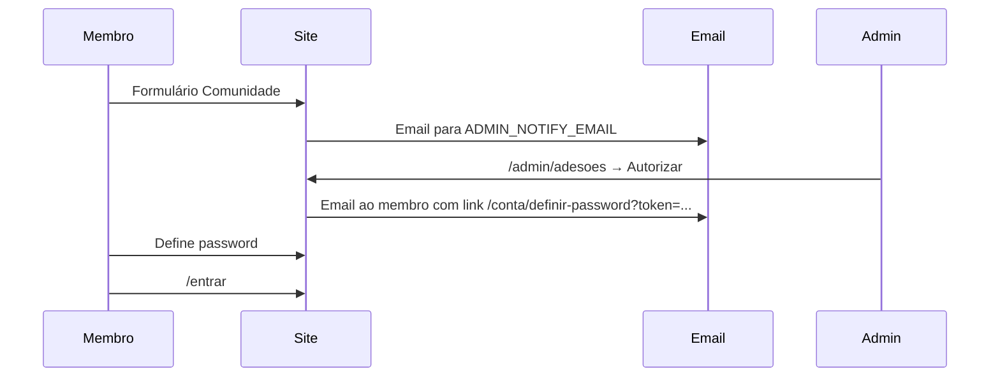

# Membros e administração — O Carrista

## Papéis

| Papel | Como entra | O que faz |
|-------|------------|-----------|
| **Utilizador** | Pedido em Comunidade → admin autoriza → email com link → define password → `/entrar` | Loja, comunidade (futuro: mais áreas restritas) |
| **Administrador** | `/admin/entrar` com nickname + password **global** (env) | Autoriza adesões, apaga perguntas do workshop |

Não há vários administradores na base de dados: **uma conta admin** definida por variáveis de ambiente.

## Fluxo de adesão

## Notificações

### Admin — novo pedido

- **Email** (recomendado): configure `RESEND_API_KEY`, `EMAIL_FROM`, `ADMIN_NOTIFY_EMAIL`
- O email contém link para `/admin/adesoes`
- **Sem email**: o admin deve entrar em `/admin` e ver o contador de pendentes

### Membro — aprovado

- Email com link único (7 dias) para `/conta/definir-password?token=...`
- Depois entra em `/entrar` com email + password **escolhida por ele**

### Membro — recusado

- Email opcional de recusa (se Resend configurado)

## Configuração Vercel

1. **Neon Postgres** → `DATABASE_URL`
2. Executar SQL em `scripts/init-db.sql` no SQL Editor Neon
3. **Resend** (emails) → `RESEND_API_KEY`, `EMAIL_FROM` (ex. `O Carrista <noreply@teudominio.pt>`)
4. `ADMIN_NOTIFY_EMAIL` — quem recebe avisos de novas adesões
5. `SITE_URL` — `https://teu-dominio.pt` (links nos emails)
6. `SESSION_SECRET` — string longa aleatória (mín. 32 caracteres)
7. Admin:
   - `ADMIN_USERNAME` — `Admin1762`
   - `ADMIN_PASSWORD` — (definir na Vercel; valor por defeito no código se omitir)
   - `ADMIN_NOTIFY_EMAIL` — `ocarrista.cc@gmail.com` (adesões e pedidos de loja)
8. Redis (perguntas workshop) — como antes

## URLs

- `/admin/entrar` — administração
- `/admin/adesoes` — autorizar membros
- `/admin/perguntas` — apagar perguntas (workshop 2026)
- `/entrar` — membros aprovados
- `/conta/definir-password?token=...` — primeiro acesso do membro
